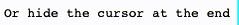

# TEXT REVEAL USING ONLY JAVASCRIPT
this script can be used on any active project, as it is working with HTML 
elementNode.innerHTML strings. Script replaces characters with 
whitespaces, then reveals it by your desire. If javascript is disabled, 
text will still be available as it will never be replaced with 
whitespaces.

# How To Use

## Tip
Best to use with monospace font
```css
#demo{
   font-family: monospace;
}
```

## Embeding to .HTML
1. Import `main.js` as module to your HTML
   `import { FromCharCode, Cursor } from "./main.js";`
2. Create new instance object
   - `FromCharCode(element, interval, multInterval)`
     - `element` - HTML node with string inside innerHTML
     - `interval` - time between change of one character in _ms_
     - `multInterval` - time in _ms_ between starting searching new character. If ommited, then script waits till n-1 
character is found
   - `Cursor(element, interval, disappear)`
     - `element` - HTML node with string inside innerHTML
     - `interval` - time to reveal next character in _ms_
     - `disappear` - false = | after "writting" string keeps blinking; true = | disappears
    ```javascript
   import { FromCharCode, Cursor } from "./main.js";

   FromCharCode(element, interval, multInterval)
    Cursor(element, interval, disappear)
    ```


## Usage

`let demo = new FromCharCode(document.getElementById("demo"), 300, 1);`


## 

`let demo = new FromCharCode(document.getElementById("demo"), 8);`


## 

`let demo = new Cursor(document.getElementById("demo"), 150, false);`


## 

`let demo = new Cursor(document.getElementById("demo"), 300, true);`


